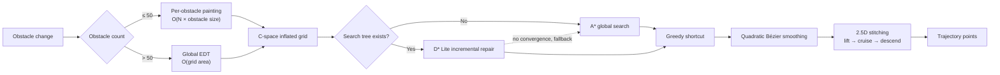

<div align="center">

# Smart Crane Pathfinding System

**A 2.5D motion planner for industrial overhead cranes (prototype)**

Computes collision-free trajectories that respect crane kinematics
in workshop environments with dynamic obstacles.
Rust algorithm core · Python service layer · Web digital twin.

[](https://github.com/newcovid/Smart-Crane-Pathfinding-System/actions/workflows/ci.yml)
[](https://www.python.org/)
[](https://pyo3.rs/)
[](LICENSE)

[简体中文](README.md) · English

</div>

---

## Background

Overhead crane planning differs from mobile robot navigation in three ways that
make a generic grid planner insufficient:

**The hoist and its load occupy space.** A crane cannot be treated as a point mass.
Obstacles must be inflated by the physical footprint and planning must happen in
configuration space. This project uses the circumscribed radius `hypot(w, l) / 2`
for rectangular hoists, which stays valid at any rotation angle.

**The environment keeps changing.** Forklifts, personnel and temporary stock appear
continuously. Running a full search on every change does not meet cycle-time
requirements above roughly 300×300 cells, so D\* Lite handles incremental replanning.

**Motion is mechanically constrained.** The hoist must not traverse before reaching
safe height, and the polyline output of a grid search makes the bridge and trolley
accelerate and decelerate repeatedly. The system therefore performs 2.5D three-phase
trajectory stitching followed by Bézier smoothing.

---

## Features

- **A\*** global search and **D\* Lite** incremental replanning behind one planner interface
- **2.5D fixed-height cruise**: lift → traverse at cruise altitude → descend
- **C-space inflation** switching between geometric painting and Euclidean distance
  transform based on obstacle density
- **Trajectory post-processing**: greedy shortcut optimisation and quadratic Bézier
  smoothing, with grace zones at the endpoints
- **Dual engine**: Rust core (PyO3) and a pure-Python implementation, switchable at
  runtime, with equivalence enforced by tests
- **Web digital twin**: synchronised 2D topology and 3D scene views over Socket.IO
- **Offline first**: all frontend dependencies are vendored; no network access at runtime

---

## Quick start

Requires Python 3.10 or newer.

```bash
git clone https://github.com/newcovid/Smart-Crane-Pathfinding-System.git
cd Smart-Crane-Pathfinding-System
pip install -r requirements.txt
python app.py
```

Open `http://127.0.0.1:5000`. Drag obstacles in the 2D view to trigger incremental
replanning; the 3D view mirrors trajectory execution.

### Optional Rust acceleration

```bash
pip install maturin
maturin develop --release
```

Without the extension the system falls back to the pure-Python implementation with
no loss of functionality. Build artifacts are not committed — they are bound to a
specific Python minor version and will not load across versions.

### Tests

```bash
python -m unittest discover -s tests -v
```

Cross-engine equivalence tests skip automatically when the Rust extension is absent.

---

## How it works



### 2.5D trajectory stitching

A shortest path in the plane is only part of the answer. Real crane motion has three
phases — **lift in place → traverse at cruise altitude → descend at the target** —
and the order is dictated by mechanical constraints.

When the start position falls inside the inflation layer (for example, a load stored
next to equipment), the planner performs an escape manoeuvre in this order:

```
Start(Z_low) → Escape(Z_low) → Escape(Z_high) → Cruise… → End
```

That is, **traverse out of the danger zone at low altitude first, then lift**.
Obstacles have height: lifting straight up may collide with equipment directly
overhead, whereas a low-altitude traverse only needs to clear the ground projection.

Post-processing applies to the cruise segment only. The corner points of the vertical
segments are rigid; including them in Bézier smoothing would cut the corners and route
the path through equipment.

### Density-adaptive grid generation

C-space inflation has two implementations with opposite complexity characteristics,
selected by obstacle count:

| Obstacle count | Algorithm | Complexity |
|---|---|---|
| ≤ 50 | Per-obstacle geometric painting | `O(obstacles × obstacle size)` |
| > 50 | Global Euclidean distance transform | `O(grid area)` |

The threshold lives in `src/common/constants.rs`.

The two sides are implemented differently, which provides cross-validation: the Rust
side is a hand-written two-pass distance transform with a 1-D parabolic lower envelope
(`src/map/grid_factory.rs`), while Python uses
`scipy.ndimage.distance_transform_edt` with morphological dilation.

Both branches measure the distance from a cell centre to the nearest **rasterised seed
cell** centre, with the same predicate `dist <= xy_margin + 0.5`. Keeping them aligned
matters: measuring to the continuous rectangle instead yields systematically smaller
distances, so the inflation layer would shrink the moment the obstacle count crosses
the threshold.

### Static layer cache

The static/dynamic split is not merely cosmetic — it determines which work can be reused.

Inflation distributes over the obstacle set: `dist(A∪B) = min(dist(A), dist(B))`, hence
`inflate(A∪B) = inflate(A) OR inflate(B)`. The inflated static layer is therefore cached,
and dynamic obstacles are painted onto a copy of it rather than triggering a full
recomputation. Dynamic obstacles are typically few, so they take the painting branch
whose cost is independent of map area.

This matters because above the density threshold the system switches to a global EDT with
`O(grid area)` complexity — and the static portion, which dominates that cost, does not
change between dynamic updates. Time to fetch the grid after a single dynamic obstacle
change (median of 12):

| Grid | Static obstacles | Rust | Python |
|---:|---:|---:|---:|
| 200×200 | 40 | 0.09 → 0.11 ms | 2.81 → **0.06 ms** |
| 300×300 | 80 | 4.19 → **0.18 ms** | 6.91 → **0.12 ms** |
| 400×400 | 120 | 8.06 → **0.30 ms** | 12.58 → **0.13 ms** |

Before this change, grid regeneration at 300×300 (4.19 ms) cost 20× the D\* Lite
incremental replan itself (0.2 ms).

`tests/test_grid.py` asserts the grid is **identical cell by cell** with and without the
split. The cache must be a pure performance optimisation: any cell flipping from occupied
to free would mean the safety margin had been relaxed.

### Dual engine and graceful degradation

`smart_crane/core/rust_bridge.py` is the single gateway to the Rust extension and
separates two concerns:

- **Can the extension load** — the result of importing `smart_crane_core` at startup
- **Should the extension be used** — a runtime switch driven by `ENABLE_RUST_CORE`

Separating them lets the pure-Python implementation be exercised by tests even on
machines where the extension is installed. The `RustBackend.disabled()` context manager
runs both implementations within a single process.

> **What "equivalent" means here**: the two implementations guarantee an **identical
> interface** and **equal path cost**, not point-by-point identical trajectories.
> Rust uses `f32` and Python uses `f64`, so equal-cost paths may break ties differently.
> See `tests/test_pathfinding.py::TestEngineEquivalence`.

---

## Performance

Maps are generated from a fixed random seed (22% obstacle ratio, 4×4 rectangular
blocks); each figure is the median of three runs. The comparison is A\* full search
versus D\* Lite incremental replanning after one obstacle change on the same map.
The timing window includes `update_obstacles()` — the full cost of one environment change.

Figures come from the CI `benchmark` job, which runs pure Python and then the Rust
build on the same runner in the same job, so the rows are directly comparable
(ubuntu-latest / Python 3.12).

| Grid | Engine | A\* full | D\* Lite incremental | Speedup | Path steps |
|---:|:---|---:|---:|---:|---:|
| 100×100 | Python | 13.6 ms | 1.6 ms | 8× | 114 |
| 100×100 | **Rust** | **1.1 ms** | **0.1 ms** | 18× | 114 |
| 200×200 | Python | 52.2 ms | 3.3 ms | 16× | 226 |
| 200×200 | **Rust** | **3.6 ms** | **0.1 ms** | 32× | 226 |
| 300×300 | Python | 201.7 ms | 5.7 ms | 35× | 351 |
| 300×300 | **Rust** | **15.4 ms** | **0.2 ms** | 88× | 351 |

- The incremental advantage grows with scale: at 300×300 one obstacle change costs
  1/35 (Python) to 1/88 (Rust) of a full search
- The Rust core contributes roughly a 13× constant-factor speedup
- Path step counts match row by row across engines, consistent with the equivalence tests

Reproduce locally:

```bash
python benchmarks/bench.py --sizes 100 200 300 --repeat 3
python benchmarks/bench.py --engine both     # both engines in one run
```

---

## Configuration

Settings are managed by Pydantic Settings and support environment variables, a `.env`
file and runtime hot-reload. See `smart_crane/core/config.py` for the full list.

| Variable | Default | Description |
|---|---|---|
| `MAP_WIDTH_M` / `MAP_LENGTH_M` / `MAP_HEIGHT_M` | 20 / 20 / 20 | Workshop dimensions (m) |
| `MAP_RESOLUTION_M` | 1.0 | Grid resolution (m per cell) |
| `CRANE_FOOTPRINT_WIDTH` / `_LENGTH` / `_HEIGHT` | — | Hoist footprint |
| `ENABLE_FIXED_HEIGHT_CRUISE` | `true` | 2.5D cruise mode; disable for full 3D planning |
| `OBSTACLE_INFINITE_HEIGHT` | `true` | Treat obstacles as infinitely tall (conservative, faster) |
| `PLANNER_ALGORITHM` | `dslite` | `astar` or `dslite` |
| `ENABLE_RUST_CORE` | `true` | Global Rust backend switch |
| `HEURISTIC_WEIGHT` | 1.0 | Weighted A\*. Ignored by D\* Lite — see [design notes](#why-d-lite-ignores-the-heuristic-weight) |
| `SECRET_KEY` | random | Flask session key. Set explicitly in production, otherwise sessions reset on restart |
| `LOG_LEVEL` | `INFO` | Log level |

### Deployment

The bundled server uses Flask-SocketIO in `threading` mode with `simple-websocket`
and performs no monkey-patching. This suits single-operator and demo scenarios.

For higher concurrency, switch to gevent:

```bash
pip install gevent gevent-websocket
gunicorn -k geventwebsocket.gunicorn.workers.GeventWebSocketWorker -w 1 app:app
```

Socket.IO connections are stateful; scaling beyond one worker requires a message queue
such as Redis.

---

## Limitations and known issues

This is a **prototype** and has not run in production.

### Interfaces defined but not implemented

- Point cloud to grid conversion for the frontend lidar
- Backend variable-frequency drive control interface
- Multi-crane coordination and collision avoidance

The project was discontinued due to a change in business requirements; the three items
above stop at interface definition.

### Cross-engine behavioural differences

Not yet aligned; pull requests welcome:

| Item | Current behaviour |
|---|---|
| Semantics of `z_m == 0` | Rust treats it as "unknown height" and substitutes `DEFAULT_Z_HIGH`; Python treats it as a literal zero height |
| Dimension check in escape logic | Rust decides 3D from `layers > 1`, so it searches the Z axis even in 2.5D mode |
| `nodes_expanded` | Rust A\* performs no stale-entry check, inflating the count; not comparable with Python (the paths themselves are verified equal by the equivalence tests) |
| `replanning_count` | On the Rust side this is a cumulative `AtomicUsize` that does not reset on `initialize` |

### Security

The web endpoints have no authentication; any client that can reach the port can modify
the map and configuration. Suitable for trusted networks only — add access control
before exposing it publicly.

---

## Design notes

### The `update_obstacles` contract

`(x, y, new_state)` in 2D, `(x, y, z, new_state)` in 3D. Coordinates are taken with
`change[:-1]`.

Tuples of the wrong length, or coordinates out of range, are logged as a warning and
skipped. An earlier implementation silently used `continue`, leaving callers unaware
that the update had not taken effect; the symptom was a search state diverging from the
actual map and gradient descent tripping loop detection — far removed from the cause.

### Why D\* Lite ignores the heuristic weight

D\* Lite's correctness depends on heuristic **consistency**: for adjacent nodes `u`
and `v`, `h(u) ≤ cost(u,v) + h(v)` must hold. Multiplying `h` by a factor greater than 1
breaks that precondition and the `g` values produced by incremental repair are no longer
shortest costs.

Both engines therefore force `heuristic_weight = 1.0` and log a warning when a different
value is supplied. Use A\* for weighted search.

### Floating-point infinity in consistency checks

When `g` and `rhs` are both `INF`, `abs(g - rhs)` evaluates to `NaN`, and every
comparison involving NaN is False. Writing `abs(g - rhs) <= EPSILON` therefore classifies
"both ends unreachable" — a consistent state — as inconsistent, pushing `(INF, INF)` keys
back into the priority queue repeatedly. The correct form tests `==` first
(`inf == inf` is true) before the EPSILON comparison.

### Bounds checks precede indexing

Negative indices wrap around in Python. Without a bounds check, `is_obstacle((-1, c))`
reads from the opposite edge of the map, making diagonal-crossing checks along the four
borders unreliable. The current implementation treats out-of-range coordinates as
obstacles, matching `is_obstacle_unsafe` on the Rust side.

### Lazy imports and the dependency cycle

`core/__init__.py` uses a PEP 562 module-level `__getattr__` for lazy imports.

There is a dependency cycle: `pathfinding.base` in the algorithm layer needs
`core.constants`, and importing any `core` submodule initialises the whole package.
If the package eagerly imported `crane_service`, that would load
`algorithms.trajectory_planner`, which in turn depends on the partially initialised
`pathfinding.base`. Lazy imports keep the public API unchanged while allowing any
submodule to serve as an entry point.

### Others

- **Shared lock**: the `MapManager` `RLock` is injected into the planner so map data and
  planner share one lock
- **Async logging**: `QueueHandler` + `QueueListener` move WebSocket push and file
  rotation off the main loop
- **Split timing**: `grid_prep` and `algo` are measured separately and accumulated across
  events, separating grid generation cost from search cost
- **Payload sanitising**: NumPy scalars and `NaN` / `Inf` are converted to JSON-safe
  values (`float('inf')` serialises as `Infinity`, which `JSON.parse` rejects)
- **Grace zones**: sampled points within 0.5 m of the start and goal skip collision
  checks. The goal is usually adjacent to equipment and therefore inside the inflation
  layer; without the exemption the line-of-sight check in post-processing rejects every
  shortcut

---

## Development

```bash
python -m unittest discover -s tests -v          # tests
python benchmarks/bench.py --engine both         # benchmarks
cargo fmt --all && cargo clippy --all-targets    # Rust lints
```

CI runs both the pure-Python and Rust configurations on Ubuntu and Windows, and
produces a dual-engine benchmark comparison on a single runner.

---

## License

[MIT](LICENSE). Third-party components are listed in
[THIRD_PARTY_NOTICES.md](THIRD_PARTY_NOTICES.md).
