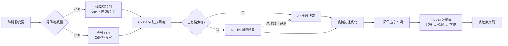

<div align="center">

# Smart Crane Pathfinding System

**工业天车的 2.5D 路径规划系统（原型）**

在含动态障碍物的车间环境中，解算符合起重机运动学约束的无碰撞轨迹。
Rust 算法核心 · Python 业务层 · Web 数字孪生。

[](https://github.com/newcovid/Smart-Crane-Pathfinding-System/actions/workflows/ci.yml)
[](https://www.python.org/)
[](https://pyo3.rs/)
[](LICENSE)

简体中文 · [English](README.en.md)

</div>

---

## 目录

- [背景](#背景)
- [特性](#特性)
- [快速开始](#快速开始)
- [工作原理](#工作原理)
- [性能](#性能)
- [配置](#配置)
- [项目结构](#项目结构)
- [限制与已知问题](#限制与已知问题)
- [设计说明](#设计说明)
- [开发](#开发)
- [许可证](#许可证)

---

## 背景

桥式起重机（天车）的路径规划与移动机器人有三点关键差异，通用的栅格寻路实现无法直接套用：

**吊具与货物占据空间。** 起重机不能按质点处理，需按物理足迹膨胀障碍物，在构型空间（C-Space）中规划。
本项目对矩形吊具采用外接圆半径 `hypot(w, l) / 2`，保证任意旋转角下均不超出。

**环境持续变化。** 叉车、人员与临时堆放物随时出现。每次变化都执行全量搜索，
在 300×300 以上的栅格上无法满足节拍要求，因此采用 D\* Lite 进行增量重规划。

**运动受机械约束。** 吊具在升至安全高度前不可横移；栅格搜索产生的折线路径
会导致大车与小车反复加减速。为此系统实现了 2.5D 三段式轨迹拼接与贝塞尔平滑。

---

## 特性

- **A\*** 全局搜索与 **D\* Lite** 增量重规划，共用统一的规划器接口
- **2.5D 定高巡航**：提升 → 巡航层平移 → 下降的三段式轨迹拼接
- **C-Space 膨胀**：按障碍物密度在几何绘制与欧氏距离变换（EDT）之间自动切换
- **轨迹后处理**：贪婪捷径优化 + 二阶贝塞尔平滑，带起终点豁免区
- **双引擎**：Rust 核心（PyO3）与纯 Python 实现，运行时可切换，等价性由测试守护
- **Web 数字孪生**：2D 拓扑与 3D 场景双视图，Socket.IO 实时同步
- **离线优先**：前端依赖全部本地化，运行时不访问外部网络

---

## 快速开始

需要 Python 3.10 或更高版本。

```bash
git clone https://github.com/newcovid/Smart-Crane-Pathfinding-System.git
cd Smart-Crane-Pathfinding-System
pip install -r requirements.txt
python app.py
```

浏览器访问 `http://127.0.0.1:5000`。

在 2D 视图中拖动障碍物即可观察增量重规划；3D 视图同步展示轨迹执行过程。

### 启用 Rust 加速（可选）

```bash
pip install maturin
maturin develop --release
```

未构建扩展时系统自动使用纯 Python 实现，功能完整。
编译产物不纳入版本控制——它与具体的 Python 小版本绑定，跨版本无法加载。

### 运行测试

```bash
python -m unittest discover -s tests -v
```

双引擎等价性测试在未构建 Rust 扩展时自动跳过。

---

## 工作原理

### 处理链路



### 2.5D 轨迹拼接

平面最短路径只是结果的一部分。天车的实际运行分三段：
**原地提升 → 巡航层平移 → 终点下降**，顺序由机械约束决定。

当起点落在膨胀层内（例如货物堆放于设备旁），系统会先执行脱困。脱困顺序为：

```
Start(Z_low) → Escape(Z_low) → Escape(Z_high) → Cruise… → End
```

即**先在低空平移出危险区，再提升**。原因是障碍物具有高度：原地垂直上升可能与正上方设备发生碰撞，
而低空横移只需避开地面投影。

后处理仅作用于巡航段。垂直升降段的拐点是刚性的，若纳入贝塞尔平滑会被斜切，导致路径穿过设备。

### 密度自适应的栅格生成

C-Space 膨胀有两种实现，复杂度特性相反，按障碍物数量切换：

| 障碍物数量 | 算法 | 复杂度 |
|---|---|---|
| ≤ 50 | 逐障碍物几何绘制 | `O(障碍数 × 障碍尺寸)` |
| > 50 | 全局欧氏距离变换（EDT） | `O(网格面积)` |

阈值定义于 `src/common/constants.rs`。

两侧实现方式不同，构成交叉验证：Rust 侧为手写的两趟距离变换配合一维抛物线下包络
（`src/map/grid_factory.rs`），Python 侧调用 `scipy.ndimage.distance_transform_edt`
并配合形态学膨胀。

两条分支度量的都是**格心到栅格化种子格心**的距离，判据同为 `dist ≤ xy_margin + 0.5`。
这一点必须严格对齐：若绘制分支改量到连续矩形，距离会系统性偏小，
导致障碍物数量跨过阈值时膨胀层突然变窄。

### 静态层缓存

静态与动态障碍物的划分不只是显示上的区分，它决定了哪些计算可以复用。

膨胀对障碍物集合可分配——`dist(A∪B) = min(dist(A), dist(B))`，因此
`inflate(A∪B) = inflate(A) OR inflate(B)`。据此静态部分的膨胀结果被缓存下来，
动态障碍物只在其副本上叠加，无需每次重算全图。动态障碍物通常只有个位数，
走的是成本与地图面积无关的绘制分支。

意义在于障碍物数量越过阈值后会切换到复杂度 `O(网格面积)` 的全局 EDT：
此时静态部分正是开销的主要来源，而它在两次动态变更之间根本没有变化。
单次动态障碍物变更后重新取栅格的耗时（12 次中位数）：

| 地图 | 静态障碍物 | Rust | Python |
|---:|---:|---:|---:|
| 200×200 | 40 | 0.09 → 0.11 ms | 2.81 → **0.06 ms** |
| 300×300 | 80 | 4.19 → **0.18 ms** | 6.91 → **0.12 ms** |
| 400×400 | 120 | 8.06 → **0.30 ms** | 12.58 → **0.13 ms** |

改造前，300×300 上的栅格重建（4.19 ms）是 D\* Lite 增量重规划本身（0.2 ms）的 20 倍。

`tests/test_grid.py` 断言拆分前后的网格**逐格相同**——该缓存必须是纯粹的性能优化，
任何一格由占据变为空闲都意味着安全边界被放宽。

### 双引擎与降级

`smart_crane/core/rust_bridge.py` 是访问 Rust 扩展的唯一入口，区分两个概念：

- **扩展是否可加载** —— 进程启动时导入 `smart_crane_core` 的结果
- **扩展是否启用** —— 运行时开关，由 `ENABLE_RUST_CORE` 控制

二者分离使得纯 Python 实现能够在已安装扩展的环境中被测试覆盖。
`RustBackend.disabled()` 上下文管理器允许在单个进程内先后运行两套实现。

> **等价性的准确含义**：两套实现保证**接口一致**与**路径代价等价**，不保证轨迹逐点相同。
> Rust 使用 `f32`、Python 使用 `f64`，代价相同的多条路径在 tie-break 时可能选择不同分支。
> 相关断言见 `tests/test_pathfinding.py::TestEngineEquivalence`。

---

## 性能

测试地图由固定随机种子生成（22% 障碍占比，4×4 矩形块），重复 3 次取中位数。
对比对象为同一张地图上的 A\* 全量搜索与 D\* Lite 在一次障碍物变更后的增量重规划。
计时窗口包含 `update_obstacles()`，即一次环境变化的完整成本。

数据来自 CI 的 `benchmark` job：同一台 runner、同一次运行内先执行纯 Python，
再构建 Rust 扩展后重复执行，因此两组数据可直接横向比较（ubuntu-latest / Python 3.12）。

| 网格 | 引擎 | A\* 全量 | D\* Lite 增量 | 增量加速比 | 路径步数 |
|---:|:---|---:|---:|---:|---:|
| 100×100 | Python | 13.6 ms | 1.6 ms | 8× | 114 |
| 100×100 | **Rust** | **1.1 ms** | **0.1 ms** | 18× | 114 |
| 200×200 | Python | 52.2 ms | 3.3 ms | 16× | 226 |
| 200×200 | **Rust** | **3.6 ms** | **0.1 ms** | 32× | 226 |
| 300×300 | Python | 201.7 ms | 5.7 ms | 35× | 351 |
| 300×300 | **Rust** | **15.4 ms** | **0.2 ms** | 88× | 351 |

- 增量重规划的优势随规模扩大：300×300 上单次障碍物变更的重规划成本为全量搜索的 1/35（Python）至 1/88（Rust）
- Rust 核心带来约 13 倍的常数级加速
- 两个引擎的路径步数逐行一致，与等价性测试的断言相符

本地复现：

```bash
python benchmarks/bench.py --sizes 100 200 300 --repeat 3
python benchmarks/bench.py --engine both     # 单次运行内对比两个引擎
```

最新数据见 [Actions](https://github.com/newcovid/Smart-Crane-Pathfinding-System/actions)
的 job summary，或下载 `benchmark-results` artifact。

---

## 配置

配置项通过 Pydantic Settings 管理，支持环境变量、`.env` 文件与运行时热更新。
完整清单见 `smart_crane/core/config.py`。

| 环境变量 | 默认值 | 说明 |
|---|---|---|
| `MAP_WIDTH_M` / `MAP_LENGTH_M` / `MAP_HEIGHT_M` | 20 / 20 / 20 | 车间物理尺寸（米） |
| `MAP_RESOLUTION_M` | 1.0 | 栅格分辨率（米/格） |
| `CRANE_FOOTPRINT_WIDTH` / `_LENGTH` / `_HEIGHT` | — | 吊具足迹尺寸 |
| `ENABLE_FIXED_HEIGHT_CRUISE` | `true` | 启用 2.5D 定高巡航；关闭则执行完整 3D 规划 |
| `OBSTACLE_INFINITE_HEIGHT` | `true` | 将障碍物视为无限高（保守策略，计算更快） |
| `PLANNER_ALGORITHM` | `dslite` | `astar` 或 `dslite` |
| `ENABLE_RUST_CORE` | `true` | 全局启停 Rust 后端 |
| `HEURISTIC_WEIGHT` | 1.0 | 加权 A\* 的权重系数。D\* Lite 会忽略该值，原因见[设计说明](#为什么-d-lite-忽略启发式权重) |
| `SECRET_KEY` | 随机生成 | Flask 会话密钥。生产环境应显式设置，否则重启后会话失效 |
| `LOG_LEVEL` | `INFO` | 日志等级 |

### 部署

内置服务器使用 Flask-SocketIO 的 `threading` 模式配合 `simple-websocket`，
不进行 monkey-patch。该配置适用于单操作员场景与演示环境。

若需支撑更高并发，可改用 gevent：

```bash
pip install gevent gevent-websocket
gunicorn -k geventwebsocket.gunicorn.workers.GeventWebSocketWorker -w 1 app:app
```

Socket.IO 的连接具有状态，横向扩展多个 worker 时需要配置消息队列（Redis 等）。

---

## 项目结构

```text
.
├── app.py                          # Flask + Socket.IO 入口，异步日志装配
├── manage_deps.py                  # 前端依赖离线本地化脚本
├── smart_crane/
│   ├── core/
│   │   ├── config.py               # Pydantic Settings，含赋值校验
│   │   ├── constants.py            # 全局常量
│   │   ├── crane_service.py        # 业务控制器，规划器生命周期
│   │   ├── map_manager.py          # 车间地图状态（RLock 保护）
│   │   ├── rust_bridge.py          # Rust 扩展入口与全局开关
│   │   └── components/grid_factory.py   # C-Space 膨胀（SciPy EDT）
│   └── algorithms/
│       ├── trajectory_planner.py   # 策略上下文，2.5D 轨迹拼接
│       ├── pathfinding/            # base / astar / dslite
│       ├── post_processing/        # base / greedy / bezier
│       └── components/             # planner_factory / safety_guard / grid_adapter
├── src/                            # Rust 核心（PyO3）
│   ├── pathfinding/                # astar.rs / dslite.rs
│   ├── post_processing/            # greedy.rs / bezier.rs
│   ├── map/                        # manager.rs / grid_factory.rs（手写 EDT）
│   └── components/                 # safety_guard.rs / grid_adapter.rs
├── static/                         # Vue + Three.js 前端（vendor 已本地化）
├── benchmarks/bench.py             # 性能基准，支持 --engine both
└── tests/test_pathfinding.py       # 正确性与双引擎等价性测试
```

---

## 限制与已知问题

本项目是**原型**，未在生产环境中运行过。

### 预留接口但未实现

- 前端雷达点云到栅格的转换接口
- 后端变频器控制接口
- 多车联动与防碰撞调度

项目因业务变更中止，上述三项停留在接口定义阶段。

### 跨引擎行为差异

以下差异尚未对齐，欢迎提交 PR：

| 项 | 现状 |
|---|---|
| `z_m == 0` 的语义 | Rust 将其视为"未知高度"并取 `DEFAULT_Z_HIGH`，Python 视为真实的 0 高度 |
| 智能脱困的维度判断 | Rust 依据 `layers > 1` 判定 3D，2.5D 模式下会额外搜索 Z 方向 |
| `nodes_expanded` 统计 | Rust A\* 未做 stale entry 检查，计数偏高，不可与 Python 横向比较（路径本身已由等价性测试验证一致） |
| `replanning_count` | Rust 侧为跨请求累计的 `AtomicUsize`，不随 `initialize` 归零 |

### 安全性

Web 端点未做认证，任何可访问该端口的客户端都能修改地图与配置。
仅适用于可信网络环境；公网部署前需自行增加访问控制。

---

## 设计说明

### `update_obstacles` 的入参契约

2D 为 `(x, y, 新状态)`，3D 为 `(x, y, z, 新状态)`。内部以 `change[:-1]` 提取坐标。

元组长度不符或坐标越界时会记录 warning 并跳过该项。
早期实现在此处直接 `continue`，调用方无法感知更新未生效，
表现为搜索状态与实际地图脱节、梯度回溯触发环路检测——现象与根因距离较远，排查成本高。

### 为什么 D\* Lite 忽略启发式权重

D\* Lite 的正确性依赖启发式的**一致性**：对任意相邻节点 `u`、`v` 需满足
`h(u) ≤ cost(u,v) + h(v)`。对 `h` 施加大于 1 的权重会破坏该前提，
增量修复得到的 `g` 值不再是最短代价。

因此两个引擎均强制 `heuristic_weight = 1.0`，并在用户设置其他值时记录 warning。
加权搜索请使用 A\*（weighted A\*）。

### 浮点无穷与一致性判定

判断节点一致性时，若 `g` 与 `rhs` 同为 `INF`，`abs(g - rhs)` 的结果是 `NaN`，
而 NaN 参与的任何比较均为 False。直接使用 `abs(g - rhs) <= EPSILON`
会将"两端均不可达"这一一致状态误判为不一致，使 `(INF, INF)` 键反复进入优先队列。
正确做法是先做 `==` 判等（`inf == inf` 为真），再进行 EPSILON 比较。

### 越界检查先于取值

Python 的负索引会回绕到序列末尾。`is_obstacle((-1, c))` 若不先做边界检查，
将读取到地图对侧边界的内容，导致四条边上的对角线穿越判定不稳定。
当前实现将越界一律视为障碍物，与 Rust 侧的 `is_obstacle_unsafe` 语义一致。

### 惰性导入与依赖环

`core/__init__.py` 采用 PEP 562 的模块级 `__getattr__` 实现惰性导入。

原因是存在一条依赖环：算法层的 `pathfinding.base` 需要 `core.constants`，
而导入任何 `core` 子模块都会先初始化整个包；若包在 `__init__` 中急切导入 `crane_service`，
就会回头加载 `algorithms.trajectory_planner`，后者又依赖尚未初始化完成的 `pathfinding.base`。
惰性导入使公开用法保持不变，同时任意子模块均可作为独立入口。

### 贝塞尔曲线必须输出起点

拐角平滑生成的二次贝塞尔曲线以 `q0`（位于 `p0→p1` 线段上）为起点。
碰撞检查从 `t=0` 开始，因此输出也必须从 `t=0` 开始。

早期实现从 `t=1/n` 起输出，理由是"`q0` 是上一段的终点，避免重复"——但这不成立：
`q0` 距 `p1` 为平滑系数所定的距离，与上一拐角的 `q2` 并不重合。
跳过它会让实际路径变成"上一点 → curve(1/n)"这条弦，
它比校验过的"`q0` → curve(1/n)"更贴近拐角内侧，且从未被任何检查覆盖。

### 其他

- **共享锁**：`MapManager` 的 `RLock` 注入至 planner，地图数据与规划器使用同一把锁
- **异步日志**：`QueueHandler` + `QueueListener` 将 WebSocket 推送与文件轮转移出主循环
- **分项计时**：`grid_prep` 与 `algo` 分别统计并跨事件累积，以便区分栅格生成与搜索本身的开销
- **载荷清洗**：NumPy 标量与 `NaN` / `Inf` 统一转换为 JSON 安全值（`float('inf')` 序列化为 `Infinity`，前端 `JSON.parse` 无法处理）
- **豁免区**：起终点半径 0.5 m 内的采样点跳过碰撞检测。终点通常紧邻设备且本身位于膨胀层内，不设豁免会导致后处理的视线检查否定全部捷径

---

## 开发

```bash
python -m unittest discover -s tests -v          # 测试
python benchmarks/bench.py --engine both         # 基准
cargo fmt --all && cargo clippy --all-targets    # Rust 代码检查
```

CI 在 Ubuntu 与 Windows 上分别运行纯 Python 与 Rust 两种配置，
并在同一 runner 上产出双引擎基准对照。

---

## 许可证

[MIT](LICENSE)。第三方组件声明见 [THIRD_PARTY_NOTICES.md](THIRD_PARTY_NOTICES.md)。
