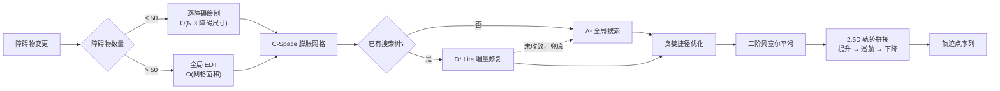

<div align="center">

# Smart Crane Pathfinding System

**工业天车的 2.5D 路径规划原型。**
Rust 算法核心 + Python 业务层 + Web 数字孪生，
在含动态障碍物的车间里实时解算符合起重机运动学的无碰撞轨迹。

[](https://github.com/newcovid/Smart-Crane-Pathfinding-System/actions/workflows/ci.yml)
[](https://www.python.org/)
[](https://pyo3.rs/)
[](LICENSE)

</div>

---

## 目录

- [为什么不是又一个 A\* Demo](#为什么不是又一个-a-demo)
- [核心设计](#核心设计)
- [性能实测](#性能实测)
- [快速开始](#快速开始)
- [配置](#配置)
- [项目结构](#项目结构)
- [已实现与未实现](#已实现与未实现)
- [工程笔记](#工程笔记)
- [许可证](#许可证)

---

## 为什么不是又一个 A\* Demo

天车吊运有三个约束，任何一个都能让教科书式的网格寻路直接失效：

**吊具和货物有体积。** 不能把起重机当质点。必须按物理足迹膨胀障碍物，
在构型空间（C-Space）里规划。本项目对矩形吊具取外接圆半径 `hypot(w, l) / 2`
——保守，但保证任意旋转角下都不会超出。

**环境是动态的。** 叉车、人员、临时堆放物随时出现。每次变化都全量重算 A\*，
在 300×300 以上的栅格上就跟不上节拍了。所以用 D\* Lite 做增量修复。

**重载设备不能急转，也不能贴地横移。** 25 吨的吊具在没升到安全高度前横移会撞设备；
栅格搜索产生的锯齿路径直接给变频器，会造成大车小车反复加减速冲击。
所以有了 **2.5D 轨迹拼接** 和贝塞尔平滑——这两件是本项目最贴近现场的部分。

---

## 核心设计

### 完整链路



### 2.5D 轨迹拼接：本项目的行业 know-how

平面上算出一条最短路径只是一半工作。天车实际运行是三段式的：
**原地提升 → 巡航层平移 → 终点下降**。顺序不能错，错了就是设备事故。

起点恰好落在膨胀层内（比如货物就堆在设备旁边）时，需要先"脱困"。
这里的顺序是反直觉的，代码里显式写成：

```
Start(Z_low) → Escape(Z_low) → Escape(Z_high) → Cruise... → End
```

**先在低空平移出危险区，再提升。** 因为障碍物是有高度的：
原地直接升到巡航层可能撞到正上方的设备，而低空横移只要避开地面投影即可。

还有一条写在代码注释里的血泪教训：

> 不要将垂直起降段放入后处理器，否则贝塞尔平滑可能会切角导致碰撞。

平滑器只作用于巡航段。垂直段的拐点是刚性的，一被"优化"就会斜切过设备。

### 密度自适应的双栅格生成

C-Space 膨胀有两种算法，复杂度特性正好相反，所以按障碍物数量切换：

| 障碍物数量 | 算法 | 复杂度 |
|---|---|---|
| ≤ 50 | 逐障碍物几何绘制 | `O(障碍数 × 障碍尺寸)` |
| > 50 | 全局欧氏距离变换（EDT） | `O(网格面积)` |

阈值定义在 `src/common/constants.rs`。稀疏场景下绘制远快于扫描全图，
密集场景下 EDT 一次搞定。

两侧实现方式也不同，而这恰好构成了交叉验证：
Rust 侧是**手写的两趟距离变换 + 一维抛物线下包络**（`src/map/grid_factory.rs`），
Python 侧调用 `scipy.ndimage.distance_transform_edt` 配合形态学膨胀。
同一个数学问题，一边手写一边调库，结果必须一致——
`tests/test_pathfinding.py::TestEngineEquivalence` 就在断言这件事。

### 双引擎与降级

`smart_crane/core/rust_bridge.py` 是访问 Rust 扩展的唯一网关，区分两件事：

- **扩展能不能用** —— 进程启动时导入 `smart_crane_core` 是否成功
- **扩展要不要用** —— 运行时开关，由 `ENABLE_RUST_CORE` 驱动

拆开是必要的：只有全局可切换，Python 实现才能在装了扩展的机器上被测试覆盖。
`RustBackend.disabled()` 上下文管理器让测试和基准可以在一次进程内跑完两套实现。

没有 Rust 工具链的人 `pip install -r requirements.txt` 之后可以直接跑，
功能完整——Python 侧是等价实现，不是桩。

> **关于"等价"的准确表述**：两套实现保证**接口一致**与**路径代价等价**，
> 但**不保证轨迹逐点相同**。Rust 用 `f32`、Python 用 `f64`，
> 代价相同的多条路径在 tie-break 时可能选到不同分支。
> 等价性由 `TestEngineEquivalence` 以代价为断言目标来守护。

---

## 性能实测

固定种子生成的地图（22% 障碍占比，4×4 矩形块），重复 3 次取中位数。
对比的是**同一张图上**：A\* 全量搜索 vs. D\* Lite 在一次障碍物变更后的增量重规划。

计时窗口包含 `update_obstacles()`——一次环境变化的真实成本是
"通知规划器 + 取出新路径"之和，只计后者会偏乐观约 8%。

**Python 原生实现**（Python 3.14 / Windows x64 / 未启用 Rust）：

| 网格 | A\* 全量 | D\* Lite 增量 | 加速比 | 路径步数 |
|---:|---:|---:|---:|---:|
| 100×100 | 11.0 ms | 1.2 ms | **9×** | 114 |
| 200×200 | 37.7 ms | 2.5 ms | **15×** | 226 |
| 300×300 | 148.9 ms | 4.4 ms | **34×** | 351 |
| 400×400 | 153.5 ms | 6.8 ms | **23×** | 443 |

规模越大，增量重规划的优势越明显——这正是它在动态环境下的价值。

复现与双引擎对照：

```bash
python benchmarks/bench.py --sizes 100 200 300 400 --repeat 3
python benchmarks/bench.py --engine both     # 同一次运行内跑完 Python 与 Rust
```

> **Rust 与 Python 的横向比值本 README 不给。**
> 作者本机没有 Rust 工具链，没实测过的数字不写。
> CI 的 `benchmark` job 会在同一台 runner 上跑 `--engine both`，
> 结果在 [Actions](https://github.com/newcovid/Smart-Crane-Pathfinding-System/actions) 的
> job summary 里可查。

---

## 快速开始

```bash
git clone https://github.com/newcovid/Smart-Crane-Pathfinding-System.git
cd Smart-Crane-Pathfinding-System
pip install -r requirements.txt
python app.py
```

浏览器打开 `http://127.0.0.1:5000`。前端资源已全部本地化到 `static/vendor/`，
运行时不访问任何 CDN——工业现场内网隔离是硬约束。
依赖的抓取与更新由 `manage_deps.py` 负责。

### 启用 Rust 加速（可选）

```bash
pip install maturin
maturin develop --release
```

编译产物不入库：它绑定具体的 Python 小版本，换个版本就 `DLL load failed`。
请本地构建。

### 运行测试

```bash
python -m unittest discover -s tests -v
```

未构建 Rust 扩展时，双引擎等价性测试会自动跳过。

### 部署注意

`SECRET_KEY` 默认每次启动随机生成，这会导致重启后会话失效。
正式部署请显式设置：

```bash
SECRET_KEY=<你的密钥> LOG_LEVEL=INFO python app.py
```

---

## 配置

所有配置项通过 Pydantic Settings 管理，支持环境变量、`.env` 文件与运行时热更新。
完整清单见 `smart_crane/core/config.py`。常用项：

| 环境变量 | 默认 | 说明 |
|---|---|---|
| `MAP_WIDTH_M` / `MAP_LENGTH_M` / `MAP_HEIGHT_M` | 20 / 20 / 20 | 车间物理尺寸（米） |
| `MAP_RESOLUTION_M` | 1.0 | 栅格分辨率（米/格） |
| `CRANE_FOOTPRINT_WIDTH` / `_LENGTH` / `_HEIGHT` | — | 吊具足迹 |
| `ENABLE_FIXED_HEIGHT_CRUISE` | `true` | 2.5D 定高巡航；关闭则走完整 3D 规划 |
| `OBSTACLE_INFINITE_HEIGHT` | `true` | 把障碍物视为无限高（保守但快） |
| `PLANNER_ALGORITHM` | `dslite` | `astar` 或 `dslite` |
| `ENABLE_RUST_CORE` | `true` | 全局启停 Rust 后端 |
| `HEURISTIC_WEIGHT` | 1.0 | 加权 A\*。**D\* Lite 会忽略并告警**，见工程笔记 |

---

## 项目结构

```text
.
├── app.py                          # Flask + Socket.IO 入口，异步日志装配
├── manage_deps.py                  # 前端依赖离线本地化脚本
├── smart_crane/
│   ├── core/
│   │   ├── config.py               # Pydantic Settings，含赋值校验
│   │   ├── constants.py            # 全局常量
│   │   ├── crane_service.py        # 业务控制器，规划器生命周期
│   │   ├── map_manager.py          # 车间地图状态（RLock 保护）
│   │   ├── rust_bridge.py          # Rust 扩展网关与全局开关
│   │   └── components/grid_factory.py   # C-Space 膨胀（SciPy EDT）
│   └── algorithms/
│       ├── trajectory_planner.py   # 策略上下文，2.5D 轨迹拼接
│       ├── pathfinding/            # base / astar / dslite
│       ├── post_processing/        # base / greedy / bezier
│       └── components/             # planner_factory / safety_guard / grid_adapter
├── src/                            # Rust 核心（PyO3）
│   ├── pathfinding/                # astar.rs / dslite.rs
│   ├── post_processing/            # greedy.rs / bezier.rs
│   ├── map/                        # manager.rs / grid_factory.rs（手写 EDT）
│   └── components/                 # safety_guard.rs / grid_adapter.rs
├── static/                         # Vue + Three.js 前端（vendor 已本地化）
├── benchmarks/bench.py             # 性能基准，支持 --engine both
└── tests/test_pathfinding.py       # 正确性 + 双引擎等价性
```

---

## 已实现与未实现

这是一个**原型**，不是可以直接上产线的产品。边界写清楚，比被问出来强。

**已实现**

- A\*、D\* Lite（增量更新 + 懒删除优先队列 + 未收敛时全量重置兜底）
- 贪婪捷径优化、二阶贝塞尔平滑、豁免区碰撞检测
- 基于足迹的 C-Space 膨胀，密度自适应双算法，支持 2D / 3D
- 2.5D 定高巡航的三段式轨迹拼接与脱困顺序
- Rust 核心 + Python 等价实现，运行时可切换，等价性有测试守护
- Web 端 2D 拓扑与 3D 场景双视图，Socket.IO 实时同步
- 配置热更新与赋值校验、异步日志与轮转、前端依赖完全离线

**预留接口但未实现**

- 前端雷达点云 → 栅格的转换接口
- 后端变频器控制接口
- **多车联动与防碰撞调度**——架构上预留了位置，未落地验证

项目因业务变更中止，上述三项停在接口定义阶段。

**已知的跨引擎差异**（尚未对齐，欢迎 PR）

| 项 | 现状 |
|---|---|
| `z_m == 0` 的语义 | Rust 当作"未知高度"取 `DEFAULT_Z_HIGH`，Python 当作真实的 0 高度 |
| 智能脱困的维度判断 | Rust 用 `layers > 1` 判 3D，2.5D 模式下会多搜一层 Z |
| `nodes_expanded` 统计 | Rust A\* 无 stale entry 检查，计数偏高，不可与 Python 横向比较 |
| `replanning_count` | Rust 侧是跨请求累计的 `AtomicUsize`，不随 `initialize` 归零 |

---

## 工程笔记

几个值得单独记一笔的决策与踩坑。

### `update_obstacles` 的静默跳过

入参契约是 `(x, y, 新状态)`（3D 为 `(x, y, z, 新状态)`），内部以 `change[:-1]` 取坐标。

少传最后一位时，坐标会被截断成非法节点，`is_valid()` 返回 False 后**直接 `continue`**——
栅格改了，但规划器从未收到通知。表现是搜索"认为自己已收敛"，
而 g 值场与实际地图脱节，梯度回溯随即在两点间震荡并触发环路检测。
从现象倒推根因要花很久。

现在非法入参会打 `warning` 并说明期望的元组形状。
**静默跳过是比崩溃更糟的失败模式**——崩溃至少告诉你哪里错了。

### 为什么 D\* Lite 忽略启发式权重

D\* Lite 的正确性依赖启发式的**一致性**：任意相邻 `u`、`v` 需满足
`h(u) ≤ cost(u,v) + h(v)`。给 `h` 乘上大于 1 的权重会破坏这个前提，
增量修复得到的 `g` 值不再是最短代价。

所以两个引擎都强制 `heuristic_weight = 1.0`，且在用户设置了其他值时告警。
加权只对 A\* 有意义（weighted A\*）。

### `INF - INF = NaN` 的陷阱

判断节点一致性时写 `abs(g - rhs) <= EPSILON`，在 `g` 和 `rhs` 同为 `INF` 时
表达式是 `NaN`，而 **NaN 参与的任何比较都是 False**——
于是"两侧都不可达"这种一致状态被误判为不一致，
（INF, INF）键被反复塞回优先队列，推高扩展数、更早触发熔断。
正确写法是先 `==` 判等（`inf == inf` 为真）再做 EPSILON 比较。

### 越界必须先于取值判断

Python 的负索引会回绕：`grid[-1][c]` 取到的是最后一行。
`is_obstacle((-1, c))` 若不先做边界检查，就会拿到地图**对侧**边界的内容，
使四条边上的对角线穿越判定时对时错。现在越界一律视为障碍物，与 Rust 侧对齐。

### 包只能从特定入口导入

`core/__init__.py` 曾急切导入 `crane_service`，而算法层的 `pathfinding.base`
需要 `core.constants`——导入任何 `core` 子模块都会先初始化整个包，形成依赖环。
结果是先导入算法层会抛 `partially initialized module`，
只有从 `smart_crane.core.config` 进入才碰巧成功。

改用 PEP 562 的模块级 `__getattr__` 做惰性导入，公开用法不变，
但任意子模块都能作为独立入口。`TestImportEntryPoints` 覆盖了四个入口。

### 其他设计决策

- **锁共享而非各自持有**：`MapManager` 的 `RLock` 注入给 planner，
  地图数据和规划器用同一把锁，避免两把锁各管一半。
- **异步日志**：`QueueHandler` + `QueueListener` 把 WebSocket 推送和文件轮转
  移出主循环，规划算法不会因为一条日志的 socket I/O 被阻塞。
- **性能计时分两条账**：`grid_prep` 与 `algo` 分开统计，还跨事件累积——
  D\* Lite 的性能故事必须把栅格生成排除掉才讲得清。
- **`_sanitize_payload`**：NumPy 标量与 `NaN` / `Inf` 统一转成 JSON 安全值。
  `float('inf')` 序列化出来是 `Infinity`，前端 `JSON.parse` 会直接炸。
- **豁免区（Grace Zone）**：起点终点半径 0.5 m 内的采样点跳过碰撞检测。
  终点常常就贴在设备旁边（本来就在膨胀层里），不开这个口子，
  后处理的视线检查会把所有捷径都否掉。

---

## 许可证

[MIT](LICENSE)。第三方组件声明见 [THIRD_PARTY_NOTICES.md](THIRD_PARTY_NOTICES.md)。
